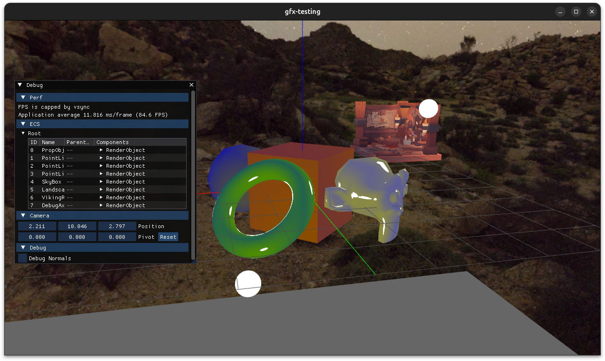

# gfx-testing

This repo is used as a testbed for low-level graphics and game engine programming. The primary target is Linux+Vulkan,
though all the dependencies and code are cross-platform.

## Tech

* Draws are done through the [SDL3 GPU API](https://wiki.libsdl.org/SDL3/CategoryGPU), a thin wrapper over modern
  graphics APIs.
* Input and output is handled through SDL.
* [EnTT](https://github.com/skypjack/entt) for the entity-component-system.
* [Dear ImGUI](https://github.com/ocornut/imgui) for debug menus.
* Shaders are [written in HLSL](./content/shaders/src) and [compiled to SPIR-V](./app/spirv_header_gen) at build time.
  C++ headers are generated from the compiled shaders, allowing for easy binding.
* [Scenes](content/scenes/default.json) can be loaded from various formats including OBJ
  and [glTF](https://github.com/KhronosGroup/glTF).

## Gallery

## Building

See [CLAUDE.md](CLAUDE.md) for detailed instructions. The vast majority of the code in this repo was handwritten by a
human, but several recent additions have been made using Claude.